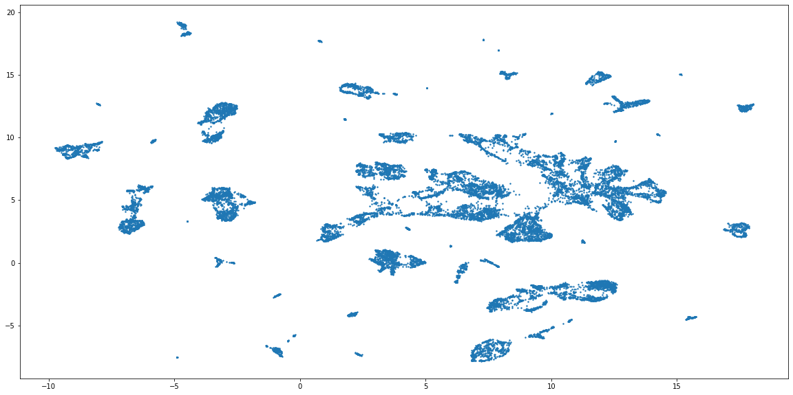
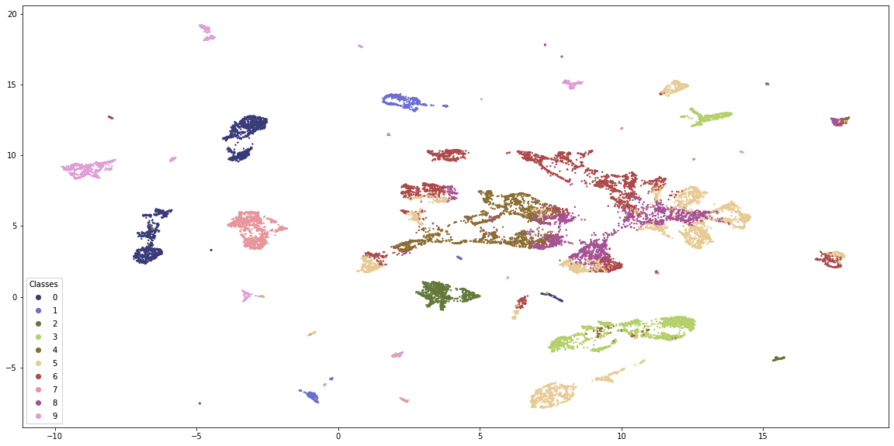
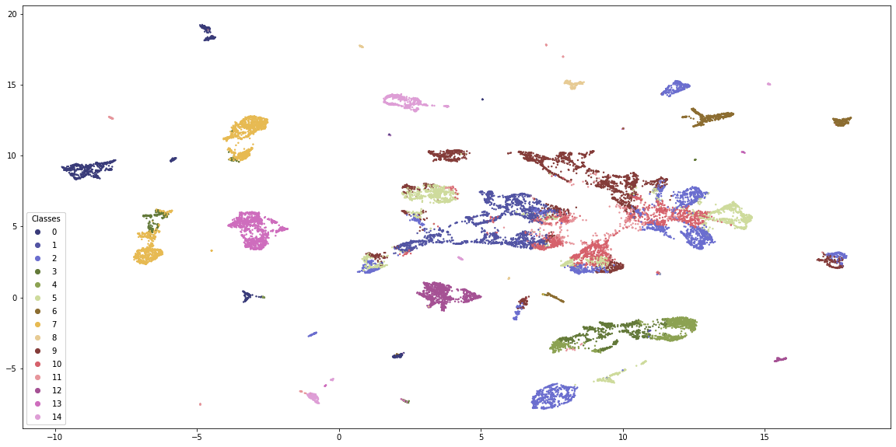
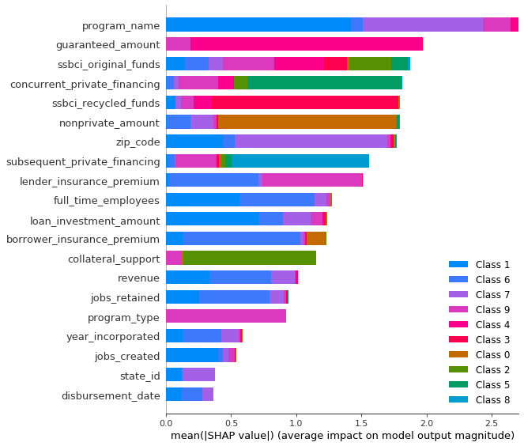
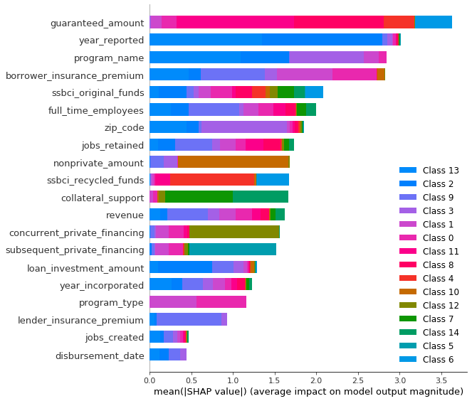

## Blogpost - Using Machine Learning to Analyze and Predict the Effectiveness of The SSBCI 

[Back to Team Page](index.md)

### Background
The State Small Business Credit Iniative (SSBCI) was created as part of the Small Business Jobs Act of 2010, with the goal of helping small businesses address a range of challenges when securing financing. The program allocated $1.4 billion dollars to be distributed to states. The states then use the funds to spur private sector investment by sharing risk. The funds are distributed through a number of programs and institutions, primarily community banks, community development financial institutions (CDFIs), and local investors. In this way, risk of repayment was shared by government and private investors, encouraging lending. States operated five types of programs under SSBCI: capital access programs, loan guarantee programs, loan participation programs, collateral support programs, and venture capital programs. 

The program ran from 2010-2017 and created $10.7 billion in new financing from over 21,000 loans and investments. Almost $9 for every $1 in SSBCI funds loaned to or invested in a small business until the program was sunset in September of 2017. 

Now, the SSBCI is being reimplemented as part of the American Rescue Plan of 2021, this time with $10 billion. This would mean nearly $100 billion in new financing for small businesses (assuming the loan creation ration stays the same). This leads to a question: Can we use machine learning models to predict the success of an individual company receiving funds? Specifically, will a company that receives funds be able to create jobs and/or retain employees?

The Dataset
The dataset consist of data for every company participating in the program from the entirety of 2010 to 2017. It includes the type of program the business received funding through as well as how much. To normalize for changing economic conditions, the dataset will be modified to include some macroeconomic measures such as CPI, PPI, Unemployment, and the S&P 500 index level.

Clustering Using K-Prototypes
The dataset represents a relatively heterogeneous set of companies, as each company has slightly different market conditions and geography. The suspicion was that companies are more similarly to one another than initially suspected. In fact, it is likely that the companies can be grouped in a small set of clusters.

If this is the case, it should be possible to show that each small business fits into one of several clusters. With this information, it will be possible to add the group the business belongs to as a feature for later classification. In addition, by examining the similarities of these groups using a classification algorithm, it should be possible to extract feature importance information about all small business for predictive model development.

The approach used here is first use a dimensionality reduction technique to visualize the clusters, making them countable. Then, use a clustering algorithm to determine the appropriate number of groups. For dimensionality reduction, Uniform Manifold Approximation (UMAP) is used to map the n-feature vector onto a 2 dimensional surface, creating a projection. 

The dataset contains many categorical variables so K-Means is not robust enough to give accurate groupings, and the added computational cost of creating One-Hot encoded features creates a technically constraint on the clustering algorithm. The more appropriate approach is to use K-Prototypes, which accepts both numerical and categorical data. K-Prototypes measures similarity between numerical data using Euclidean distance and between categorical data using a weighted discrete function dependent on the standard deviation and mode of each categorical feature. The cost is then calculated using the Huang cost function.

Trying to run K-Means as well as the elbow plot for optimal cluster size resulted in code that would not complete running after 10 hours. K-Prototypes runs in a matter of minutes, however the elbow plot did not complete running. Overlaying the cluster groupings using color on the UMAP projection visualizes where the clusters form relative to one another.

In order to evaluate the accuracy and quality of the clustering, we can treat the clusters as labels and build a classification model on top. Each point in the dataset is assigned a cluster according to the results of the K-Prototype algorithm. If the clusters are of high quality, the classification model will be able to predict them with high accuracy. At the same time, the models should use a variety of features to ensure that the clusters are not too simplistic. K-Prototypes was run for 8 clusters, 10 clusters, and 15 clusters, chosen by visual inspection of the UMAP projection. Calculating the F1 scores shows that 10 clusters produces the highest quality cluster grouping.

Next, calculating the SHAP values for feature importance demonstrates if the clustering is using a high number of features. As is shown, 10 clusters produces a high number of features used for determining the clusters. 

